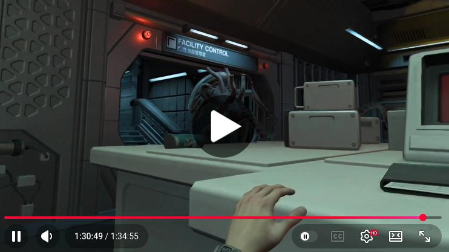

# MotherVRL (MotherVR for Linux)
This is a python patcher for the original Alien: Isolation mod called "MotherVR", which adds VR support to the game Alien: Isolation.

This patch needs that latest version (0.8.1) of the mod, which comprises of a single dxgi.dll. It patches this DLL.

Once the DLL is patched you just drop it in the Alien: Isolation game directory and configure it to be run with Proton 11 or higher. Then you run it in VR under SteamVR and it automatically picks up the DLL and adds VR interactivity and functions to the game.

Don't attempt to run this with the native Linux build of Alien: Isolation, it won't work.

## Demo

One hour and a half of gameplay, showing crafting, combat, death, flashlight usage (you have to put the hand on the side of your head for it to work) and other controls to show that the game is fully playable.

Click on the picture to watch it on youtube.

[](https://www.youtube.com/watch?v=3E1aKOKClOo)

## Installation
Drag/copy the dxgi.dll into your Alien: Isolation game directory. VR should be enabled by default when you run the game under SteamVR, but if it is not, you can do so in Options->MotherVR after the game starts up.

MotherVR by itself needs no special launch options (DXVK already loads `dxgi.dll` as native, so the game-local patched DLL is picked up automatically). If you also use GRAND-MotherVR, see its section below for the required launch option.
## Settings
Done in the in-game Options menu.
## Recalibration
You can recalibrate your position and orientation (if you aren't using VR controllers) by pressing LB + RB on a Xbox controller, or by pressing Ctrl + Alt on the keyboard.

## GRAND-MotherVR
GRAND-MotherVR is a separate mod that builds on top of MotherVR, adding extra enhancements to the VR experience (better anti-aliasing/TAA, image sharpening, a reworked HUD, body-presence options, smoke tweaks, snap/smooth rotation tuning, and more). It ships as a single `XINPUT1_3.dll` and is configured through a `grand.ini` file dropped next to it.

Getting it to run under Proton needs three things — a second patcher (`patch_grand_proton.py`), a launch option, and one extra dependency:

### 1. Patch the DLL
GRAND verifies MotherVR's `dxgi.dll` by checksum and refuses to inject if it doesn't match the stock release. Because the Proton fix changes that checksum, `patch_grand_proton.py` updates GRAND's expected value to match *your* patched `dxgi.dll`. Always patch `dxgi.dll` first, then GRAND:

```
python3 patch_mothervr_proton.py "<game>/dxgi.dll" --game-exe "<game>/AI.exe"
python3 patch_grand_proton.py    "<game>/XINPUT1_3.dll" --dxgi "<game>/dxgi.dll"
```

Run both, **in this order**, whenever you update either mod — GRAND's patcher reads the patched `dxgi.dll`'s checksum, so it must run after the MotherVR patcher. Each patcher writes a `.bak` of the original.

### 2. Force the DLL to load
Proton loads its own built-in XInput and ignores the game-local `XINPUT1_3.dll` unless you override it. Add this to the game's Steam launch options:

```
WINEDLLOVERRIDES="dxgi=n,b;XINPUT1_3=n,b" %command%
```

Only `XINPUT1_3=n,b` is strictly required (the `dxgi=n,b` part is harmless and redundant, since DXVK already loads `dxgi.dll` as native — it's included here just to make the intent explicit). If you want the GRAND log file, append `-log` after `%command%`; it writes `ai-grand.log` to the game folder.

### 3. Install the real Microsoft HLSL compiler
GRAND recompiles the game's shaders at runtime, which Wine's built-in `d3dcompiler_47` can't do — it fails and crashes the game. Install the Microsoft version into the game's Proton prefix once (214490 is Alien: Isolation's Steam app id):

```
protontricks 214490 d3dcompiler_47
```

Then drop both the patched `dxgi.dll` and `XINPUT1_3.dll` (plus `grand.ini`) into the Alien: Isolation game directory and launch as usual.
